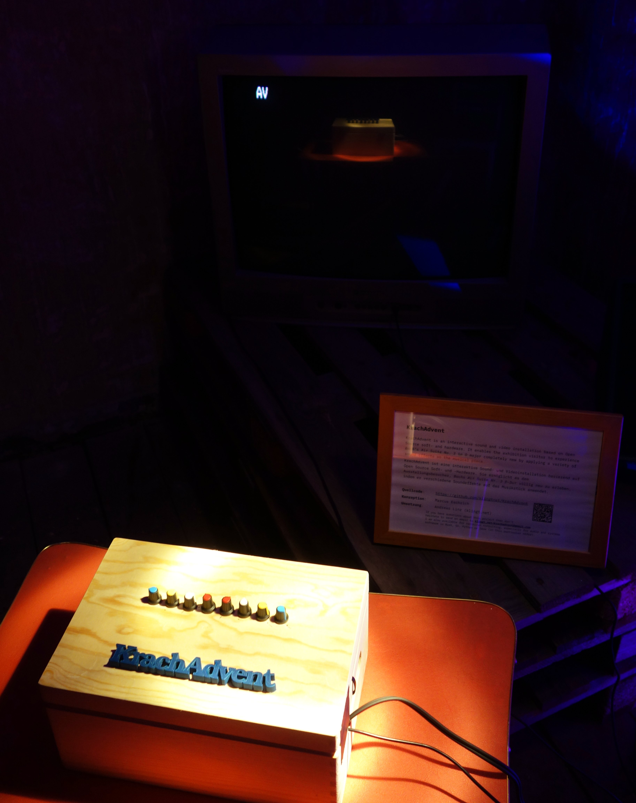

# KrachAdvent (work-in-progress)

¹

KrachAdvent is an interactive sound installation for the 2018 [BachAdvent][1] in Arnstadt, Germany.
All of the samples used and source code written for this project is contained in this repository.

- Implementation: [Andreas Linz][2]
- Concept: Marcus Eschrich

¹ Thanks to Justus for providing the photo!

[1]: https://bach-advent.de/veranstaltungsort/49/spittel-altes-spital/
[2]: https://klingt.net
